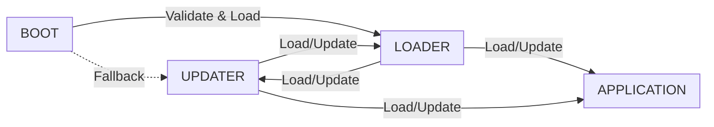

  
  


# STM32F4 Multi‑Stage Bootloader System (C)

A complete C implementation of a four‑stage bootloader for STM32F4, featuring structured image headers, CRC32 validation, delta‑patch updates, AES‑128‑GCM encryption via mbedTLS, and support for UART/XMODEM, I²C, and SPI transports.

## Architecture Overview

This bootloader comprises four separable flash regions, each starting with a 0x200‑byte header (magic number, version, CRC32, vector table address):



## Security and Safety Measures

### Firmware Validation
- **Magic Number Verification** ensures each image header carries a unique identifier before execution.
- **CRC32 Validation** leverages the STM32’s CRC peripheral (POLY32 = 0x04C11DB7, INIT = 0xFFFFFFFF) or software fallback for integrity checks.
- **Version Control** rejects any firmware with a version ≤ the current one.

### AES‑128‑GCM Encryption
- Utilizes mbedTLS’s GCM module for authenticated encryption and GMAC tag verification.

### Delta‑Patch Updates
- Implements delta encoding (BSDiff derivative) in C for binary diffs, minimizing update sizes.

### Transport Interfaces
- **UART + XMODEM (CRC‑16)** with a robust CRC‑16.
- **I²C Bootloader** commands.
- **SPI Bootloader** commands.

### Flash Memory Protection
- Sector‑based erase/write with pre‑validation and comprehensive error handling.
- Pre‑update header verification to guard against flash corruption.

### Boot Safety Mechanisms
- **Fallback Logic**: if the Loader fails validation, the Boot jumps to the Updater.

## Memory Layout

```
Flash (0x0800_0000 – 0x0808_0000):
  0x0800_0000 – 0x0800_2000  Boot (8KB + header)
  0x0800_2000 – 0x0800_4000  Loader (16KB + header)
  0x0800_4000 – 0x0800_6000  Updater (16KB + header)
  0x0800_6000 – 0x0808_0000  Application (468KB)
```

## Build and Flash Instructions

### Prerequisites
- GNU Arm Embedded Toolchain (`arm-none-eabi-gcc`)
- STM32Cube HAL
- mbedTLS C library
- CMake build system

## Project Structure

```
├── boot/                 # First‑stage bootloader
├── loader/               # Main bootloader
├── updater/              # Updater bootloader
├── application/          # User application
├── common/               # Shared modules: flash, image, delta, crypto
│   ├── include/
│   └── src/
│       ├── crc32.c
│       ├── delta.c
│       ├── gcm_gmac.c
│       ├── xmodem.c
│       └── ...
├── drivers/              # STM32Cube generated drivers
├── linker/               # linker scripts
├── scripts/              # Utility scripts (makefile fragments, diff generators)
└── CMakeLists.txt        # Top‑level build organization
```

## Safety Considerations
- **Never overwrite Boot**: Boot region is immutable post‑production.
- **Stack pointer and vector table checks** before jumping to any component.

